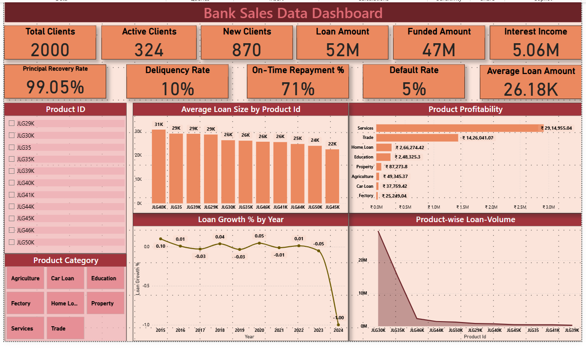
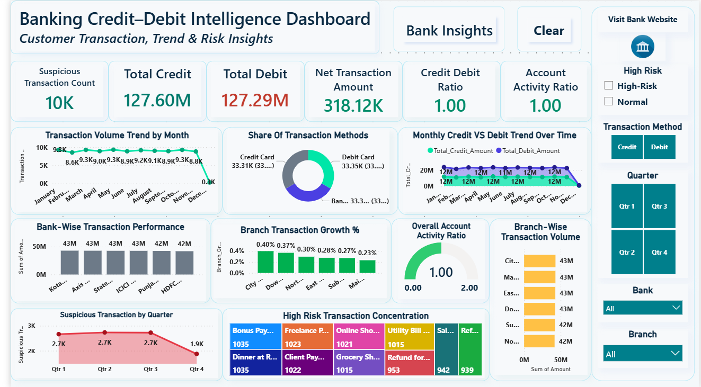

# Banking Performance & Transaction Analytics

**Banking Performance & Transaction Analytics** is an end-to-end Data Analytics project focused on understanding **loan portfolio performance** and **banking transaction activity** using **SQL, Excel, and Power BI**.

The project analyzes lending performance, client activity, repayment behavior, default and delinquency indicators, branch-level patterns, credit/debit transactions, and high-value transaction reviews.

The objective is to convert raw banking data into consistent KPIs, analytical findings, and management-ready reporting while also identifying data-quality and KPI-definition issues.

---

## Business Problem

A banking organization needs a reliable analytical view of two major operational areas:

1. **Loan Portfolio Performance**
2. **Credit & Debit Transaction Activity**

Existing data contains useful information, but several KPI definitions and source fields are not fully consistent.

The analysis is designed to answer questions such as:

- How many loans and unique clients are present in the portfolio?
- What is the total lending exposure?
- What are the recorded default, delinquency, recovery, and repayment patterns?
- Which branches and loan segments require closer review?
- Which loan purposes contribute most to portfolio activity?
- How are credit and debit transactions distributed?
- Which transaction methods, banks, and branches generate the most activity?
- How many transactions exceed the governed high-value review threshold?
- Are KPI definitions consistent across SQL, Excel, and Power BI?
- Are incomplete reporting periods affecting trend interpretation?

The project focuses on turning these questions into measurable KPIs and actionable business insights.

---

## Project Objectives

- Analyze overall loan portfolio performance.
- Distinguish loan records from unique banking clients.
- Evaluate default, delinquency, repayment, and recovery indicators.
- Identify branch and loan-purpose concentration.
- Analyze credit and debit transaction activity.
- Monitor transaction volume across banks, branches, and transaction methods.
- Identify transactions above a governed high-value review threshold.
- Perform SQL-based data-quality and consistency checks.
- Reconcile KPI definitions across SQL, Excel, and Power BI.
- Build management-ready dashboards and analytical reports.
- Convert analytical findings into practical business recommendations.

---

## Dataset Overview

The project uses two banking datasets covering loan portfolio and transaction activity.

| Dataset | Records | Main Purpose |
|---|---:|---|
| Loan Portfolio | 2,000 | Loan performance, clients, repayment, default, delinquency and branch analysis |
| Banking Transactions | 100,000 | Credit/debit activity, transaction methods, branches, banks and high-value reviews |

### Loan Portfolio

| Metric | Value |
|---|---:|
| Loan Records | 2,000 |
| Unique Clients | 870 |
| Total Loan Amount | ₹52.36M |
| Funded Amount | ₹52.36M |
| Investor-Funded Amount | ₹46.72M |
| Status Default Rate | 10.30% |
| Legacy Default Flag Rate | 5.00% |
| Delinquency Rate | 10.35% |
| On-Time Repayment Rate | 71.05% |

### Transaction Dataset

| Metric | Value |
|---|---:|
| Transaction Records | 100,000 |
| Unique Customers | 100,000 |
| Unique Accounts | 100,000 |
| High-Value Review Threshold | > ₹4,500 |
| High-Value Transactions | 10,428 |
| High-Value Review Share | 10.43% |

> **Note:** The project treats high-value transactions as transactions requiring review. They are **not automatically classified as fraudulent or suspicious transactions**.

---

## Tools Used

| Tool | Use in this project |
|---|---|
| **SQL / PostgreSQL** | Data validation, KPI calculation, aggregation, CTEs, window functions, rankings, trends and reconciliation |
| **Excel** | Source-data exploration, PivotTables, calculations, KPI validation and ad-hoc analysis |
| **Power BI** | Interactive dashboards, DAX measures, filtering, KPI reporting and management visualization |
| **DAX** | Dashboard measures for loan and transaction KPIs |

The project is intentionally focused on:

**SQL + Excel + Power BI + Business Analysis**

---

## Project Workflow

```text
Business Problem
       |
       v
Source Data Review
       |
       v
Data Quality & Validation
       |
       v
SQL Analysis
       |
       v
Excel Analysis & Reconciliation
       |
       v
Power BI Data Modeling
       |
       v
Interactive Dashboard
       |
       v
KPI Reconciliation
       |
       v
Business Insights
       |
       v
Recommendations
```

---

# SQL Analysis

SQL is used as the primary analytical layer for validating the data, calculating KPIs, identifying trends, and creating Power BI-ready analytical views.

The analysis includes:

- Data-quality validation
- NULL checks
- Duplicate checks
- Invalid-value checks
- Loan KPI analysis
- Transaction KPI analysis
- Branch-level analysis
- Loan-purpose analysis
- Trend analysis
- Contribution analysis
- Ranking
- Month-over-month analysis
- Rolling averages
- High-value transaction analysis
- Cross-tool reconciliation
- KPI consistency checks

---

## SQL Techniques Demonstrated

The project demonstrates practical SQL skills including:

- `SELECT`
- `WHERE`
- `GROUP BY`
- `HAVING`
- `ORDER BY`
- `CASE WHEN`
- Aggregate functions
- Subqueries
- Common Table Expressions (CTEs)
- Window functions
- `ROW_NUMBER()`
- `RANK()`
- `DENSE_RANK()`
- `LAG()`
- Rolling averages
- Percentage contribution analysis
- Month-over-month calculations
- Conditional aggregation
- Data-quality queries
- KPI reconciliation
- Analytical views for Power BI

---

# Loan Portfolio Analysis

The loan module evaluates portfolio size, client activity, repayment behavior, lending concentration, default indicators and branch performance.

## Main Loan KPIs

### Loan Records

The dataset contains:

**2,000 loan records**

This is different from the number of actual clients.

### Unique Clients

There are:

**870 unique clients**

Separating loan records from unique clients prevents multiple loans belonging to the same client from being incorrectly reported as separate customers.

---

## Default Analysis

The source data contains two different default definitions.

### Status-Based Default

Using:

```text
Loan_Status = "Default"
```

produces a:

**10.30% Status Default Rate**

### Legacy Default Flag

Using:

```text
Is_Default_Loan = "Y"
```

produces a:

**5.00% Default Flag Rate**

These measures are reported separately because they represent different definitions in the source data.

The project uses the **Status Default Rate** as the main analytical definition while retaining the legacy flag for reconciliation.

---

## Delinquency & Repayment

Recorded portfolio indicators include:

- **Delinquency Rate:** 10.35%
- **On-Time Repayment Rate:** 71.05%

Additional consistency checks show that delinquency-related source fields do not always agree with repayment-behavior fields.

This is documented as a data-quality issue rather than silently changing the source data.

---

## Client Retention

A cohort-based retention calculation was used rather than an incorrect inner-join denominator.

Among clients present in the 2020 cohort:

**49 of 200 clients returned in 2021**

Resulting in a:

**24.5% client retention rate**

This suggests an opportunity to investigate repeat borrowing and client retention.

---

## Portfolio Concentration

The analysis identifies concentration across loan purposes and branches.

The **Services** purpose represents approximately:

- **56.9% of loans**
- **57.7% of recorded interest income**

The top five branches account for approximately:

**40.4% of portfolio value**

This concentration is useful for portfolio monitoring and diversification analysis.

---

# Transaction Analysis

The transaction module analyzes **100,000 credit/debit transactions**.

The analysis covers:

- Credit activity
- Debit activity
- Transaction counts
- Bank activity
- Branch activity
- Transaction methods
- Monthly trends
- High-value transaction reviews
- Account/customer grain
- Incomplete periods
- Cross-tool KPI consistency

---

## High-Value Transaction Review

A governed threshold of:

**₹4,500**

is used for transaction review.

Transactions above ₹4,500:

**10,428**

Share of all transactions:

**10.43%**

The source workbook also contains a legacy high-risk flag using a different threshold.

The project intentionally separates these definitions to prevent inconsistent reporting.

> A high-value transaction is treated as a **review condition**, not proof of fraud.

---

# Excel Analysis

Excel is used as a complementary analytical and validation layer.

The project contains separate workbooks for:

### Loan Portfolio

```text
BankSphere_Loan_Portfolio_Analysis.xlsx
```

### Transaction Analysis

```text
BankSphere_Transaction_Analysis.xlsx
```

Excel is used for:

- Source-data review
- PivotTables
- PivotCharts
- KPI calculations
- Segment analysis
- Trend exploration
- Validation against SQL output
- Ad-hoc analyst checks
- Cross-tool reconciliation

---

# Power BI Dashboard

Power BI converts the analytical output into interactive management reporting.

The project includes dedicated reports for:

### Loan Portfolio

```text
BankSphere_Loan_Portfolio_Dashboard_1.pbix
BankSphere_Loan_Portfolio_Dashboard_2.pbix
```

### Transaction Intelligence

```text
BankSphere_Transaction_Intelligence_Dashboard.pbix
```

---

## Dashboard Capabilities

The Power BI reports support analysis across areas such as:

- Loan portfolio KPIs
- Client activity
- Default indicators
- Delinquency indicators
- Repayment behavior
- Branch performance
- Loan-purpose contribution
- Transaction volume
- Credit vs debit activity
- Bank-level transaction activity
- Branch-level transaction activity
- Transaction methods
- Monthly transaction trends
- High-value review transactions

Interactive filtering allows users to investigate individual segments without changing the underlying analytical model.

---

## Power BI / DAX Measures

The project includes documented DAX measures for:

- Loan Records
- Unique Clients
- Active Clients
- Total Loan Amount
- Principal Recovery Rate
- Status Default Rate
- Default Flag Rate
- Delinquency Rate
- Transaction Count
- Unique Customers
- Unique Accounts
- Transactions per Account
- Total Credit
- Total Debit
- Net Flow
- Credit-to-Debit Ratio
- High-Value Review Count
- High-Value Review Share

DAX definitions are available in:

```text
powerbi/DAX_Measures.md
```

---

# Dashboard Preview

### Loan Portfolio Overview



### Transaction Overview



---

# Key Findings

## 1. Loan records and clients are not the same metric

The portfolio contains:

- **2,000 loan records**
- **870 unique clients**

Separating these measures prevents the portfolio size from being incorrectly interpreted as customer count.

---

## 2. Default definitions require governance

Two different default measures exist:

- **Status Default Rate:** 10.30%
- **Legacy Default Flag Rate:** 5.00%

The difference is large enough that management reporting should clearly define which metric is being used.

---

## 3. Client retention is relatively low

Only:

**24.5%**

of clients from the 2020 cohort returned in 2021.

This creates an opportunity to investigate:

- Customer experience
- Product suitability
- Competitive alternatives
- Repeat-loan offers
- Retention programs

---

## 4. Portfolio exposure is concentrated

The Services purpose represents approximately:

**56.9% of loans**

and approximately:

**57.7% of recorded interest income**

This concentration should be monitored to avoid excessive dependence on a single lending segment.

---

## 5. Branch concentration should be monitored

The top five branches account for approximately:

**40.4% of portfolio value**

Branch contribution should therefore be reviewed alongside risk and repayment KPIs.

---

## 6. High-value transactions represent about one-tenth of activity

Using the governed threshold of more than ₹4,500:

**10,428 transactions**

require high-value review.

This represents approximately:

**10.43% of transaction activity**

---

## 7. Partial periods can distort trends

December 2024 contains only a partial reporting period.

The project therefore avoids interpreting incomplete periods as genuine month-over-month declines.

Period completeness is checked before trend conclusions are made.

---

## 8. Customer-level transaction history is limited

The transaction dataset contains:

- 100,000 transactions
- 100,000 customers
- 100,000 accounts

This means each account/customer appears only once.

Therefore, the dataset cannot reliably support conclusions about:

- Repeat transaction behavior
- Customer retention
- Transaction-frequency segmentation
- Long-term account behavior

These limitations are explicitly documented rather than hidden.

---

# Business Recommendations

### Standardize KPI Definitions

Adopt one approved business definition for default and delinquency KPIs and document it in a central KPI dictionary.

---

### Improve Client Retention

Investigate why a relatively small share of borrowers return for another loan.

Potential actions include:

- Retention campaigns
- Repeat-loan offers
- Customer feedback analysis
- Repayment-experience analysis
- Targeting customers with strong repayment histories

---

### Monitor Portfolio Concentration

Track exposure by:

- Loan purpose
- Branch
- Region
- Client segment

This can help identify over-concentration and support portfolio diversification.

---

### Govern High-Value Transaction Rules

Maintain one approved transaction-review threshold across SQL, Excel, and Power BI.

High-value flags should be treated as screening rules rather than fraud conclusions.

---

### Use Complete Reporting Periods

Exclude incomplete months or clearly label them before calculating month-over-month trends.

Average transactions per active day can also provide a more comparable measure.

---

### Improve Transaction History

Future datasets should contain multiple transactions per customer/account.

This would enable deeper analysis such as:

- Customer retention
- Transaction frequency
- Customer segmentation
- Behavioral trends
- Account activity patterns

---

### Reconcile Reports Before Release

SQL, Excel, and Power BI KPI values should be validated before dashboard publication.

The project includes dedicated reconciliation and consistency-check queries for this purpose.

---

# Data Quality & Analytical Governance

A major part of this project is identifying data-quality issues rather than simply producing charts.

Important issues identified include:

### Conflicting Default Definitions

`Loan_Status = Default` and the legacy default flag produce different results.

### Delinquency Inconsistency

Some delinquency fields disagree with recorded repayment behavior.

### Different High-Value Thresholds

The governed review threshold and legacy source flag use different cut-offs.

### Partial Reporting Period

December 2024 contains incomplete transaction data.

### Transaction Grain

Each transaction belongs to a unique customer/account in the supplied dataset, limiting behavioral analysis.

### Simulated Dataset Characteristics

The dataset appears to be simulated and is therefore used to demonstrate analytical methodology rather than make real-world banking risk claims.

---

# Repository Structure

```text
banking-performance-transaction-analytics/
│
├── README.md
│
├── data/
│   ├── csv/
│   │   ├── final_fact_cleaned.csv
│   │   └── credit_debit_bank.csv
│   └── export_excel_to_csv.py
│
├── sql/
│   ├── 00_setup.sql
│   ├── 01_loan_data_quality.sql
│   ├── 02_loan_kpi_analysis.sql
│   ├── 03_transaction_data_quality.sql
│   ├── 04_transaction_kpi_analysis.sql
│   ├── 05_powerbi_views.sql
│   ├── 06_reconciliation_queries.sql
│   ├── 07_consistency_checks.sql
│   │
│   └── postgres/
│       ├── 00_setup.sql
│       ├── 00b_load_data_psql.sql
│       ├── 01_loan_data_quality.sql
│       ├── 02_loan_kpi_analysis.sql
│       ├── 03_transaction_data_quality.sql
│       ├── 04_transaction_kpi_analysis.sql
│       ├── 05_powerbi_views.sql
│       ├── 06_reconciliation_queries.sql
│       └── 07_consistency_checks.sql
│
├── excel/
│   ├── BankSphere_Loan_Portfolio_Analysis.xlsx
│   └── BankSphere_Transaction_Analysis.xlsx
│
├── powerbi/
│   ├── BankSphere_Loan_Portfolio_Dashboard_1.pbix
│   ├── BankSphere_Loan_Portfolio_Dashboard_2.pbix
│   ├── BankSphere_Transaction_Intelligence_Dashboard.pbix
│   └── DAX_Measures.md
│
├── images/
│   ├── loan_portfolio_overview_legacy.png
│   ├── branch_performance_legacy.png
│   ├── transaction_overview_legacy.png
│   └── transaction_drilldown_legacy.png
│
└── reports/
    ├── business_problem.md
    ├── stakeholder_requirements.md
    ├── executive_summary.md
    ├── data_quality_report.md
    ├── kpi_dictionary.md
    ├── key_findings.md
    └── recommendations.md
```

---

# How to Explore the Project

## 1. Clone the Repository

```bash
git clone https://github.com/babasahebpatil-ai/banking-performance-transaction-analytics.git
```

Move into the project directory:

```bash
cd banking-performance-transaction-analytics
```

---

## 2. Review the Dataset

The analytical CSV files are available in:

```text
data/csv/
```

Main files:

```text
final_fact_cleaned.csv
credit_debit_bank.csv
```

---

## 3. Run the SQL Analysis

For PostgreSQL, use the scripts inside:

```text
sql/postgres/
```

Recommended execution order:

```text
00_setup.sql
00b_load_data_psql.sql
01_loan_data_quality.sql
02_loan_kpi_analysis.sql
03_transaction_data_quality.sql
04_transaction_kpi_analysis.sql
05_powerbi_views.sql
06_reconciliation_queries.sql
07_consistency_checks.sql
```

This sequence covers:

1. Database setup
2. Data loading
3. Data-quality validation
4. Loan analysis
5. Transaction analysis
6. Power BI analytical views
7. KPI reconciliation
8. Consistency validation

---

## 4. Explore the Excel Analysis

Open:

```text
excel/BankSphere_Loan_Portfolio_Analysis.xlsx
```

and:

```text
excel/BankSphere_Transaction_Analysis.xlsx
```

Use the workbooks to review PivotTables, calculations and analytical summaries.

---

## 5. Open the Power BI Reports

Open the `.pbix` files inside:

```text
powerbi/
```

using **Power BI Desktop**.

The documented DAX measures are available at:

```text
powerbi/DAX_Measures.md
```

---

# Skills Demonstrated

`SQL`  
`PostgreSQL`  
`Excel`  
`Power BI`  
`DAX`  
`Data Cleaning`  
`Data Validation`  
`Data Quality Analysis`  
`Exploratory Data Analysis`  
`KPI Analysis`  
`CTEs`  
`Subqueries`  
`Window Functions`  
`Ranking`  
`Trend Analysis`  
`Data Reconciliation`  
`Dashboard Development`  
`Business Analysis`  
`Business Intelligence`  
`Data Visualization`  
`Stakeholder Reporting`

---

# Project Highlights

- Analyzed **2,000 loan records**
- Identified **870 unique banking clients**
- Analyzed **100,000 banking transactions**
- Built structured SQL validation and KPI workflows
- Reconciled conflicting default definitions
- Identified **10.30% status-based default rate**
- Reconciled a separate **5.00% legacy default-flag rate**
- Identified **10,428 transactions above ₹4,500**
- Evaluated loan-purpose and branch concentration
- Built Excel-based analytical workbooks
- Developed interactive Power BI reports
- Created documented DAX measures
- Added data-quality and cross-tool reconciliation checks
- Converted analytical results into business recommendations

---

# Project Scope

This project is designed as a **Data Analyst / Business Intelligence portfolio project**.

It demonstrates how SQL, Excel, and Power BI can be combined to move from raw operational banking data to:

**validated data → KPIs → analysis → dashboards → business insights → recommendations**

The project is intended to demonstrate analytical methodology and BI skills. The supplied data appears to be simulated and should not be interpreted as representing the performance of a real financial institution.

---

## Author

**Babasaheb Patil**

- GitHub: [babasahebpatil-ai](https://github.com/babasahebpatil-ai)
- LinkedIn: [Babasaheb Patil](https://www.linkedin.com/in/babasaheb-patil-22a476319)

---

⭐ If you found this project useful, consider starring the repository.
